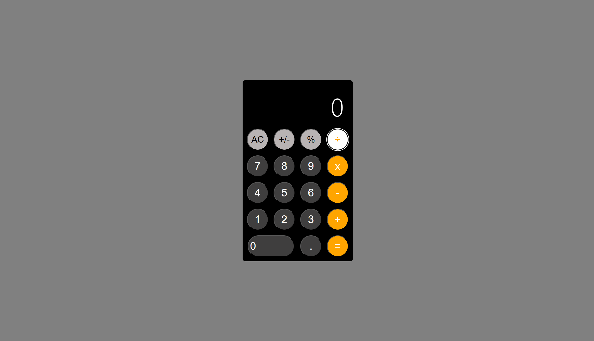

# Apple Calculator Clone

This is a simple clone of the Apple calculator app built using React, JSX , CSS, and JavaScript. It replicates the design and functionality of the Apple calculator, allowing users to perform basic mathematic calculations.

## Features

- User-friendly interface resembling the Apple calculator.
- Includes  addition, subtraction, multiplication, and division operations.
- Clear button to resets the calculator.

## Screenshots

### Landing

*Figure 1 Landing Page*

## Getting Started

To get a local copy of the project up and running, follow these steps:

### Installation

1. Clone the repository:

2. Run ` npm start ` 

3. Open application in preffered browser

### Prerequisites

- A modern web browser such as Chrome, Firefox, or Safari.

## Usage

- Click the buttons to enter numbers and perform calculations.
- Use the operators (+, -, X, /) to perform methamtic operations.
- Press the clear (A/C) button to reset the calculator.

## License

This project is licensed under the [MIT License](LICENSE).

## Acknowledgments

- The design and inspiration for this calculator clone were taken from the Apple calculator app.
